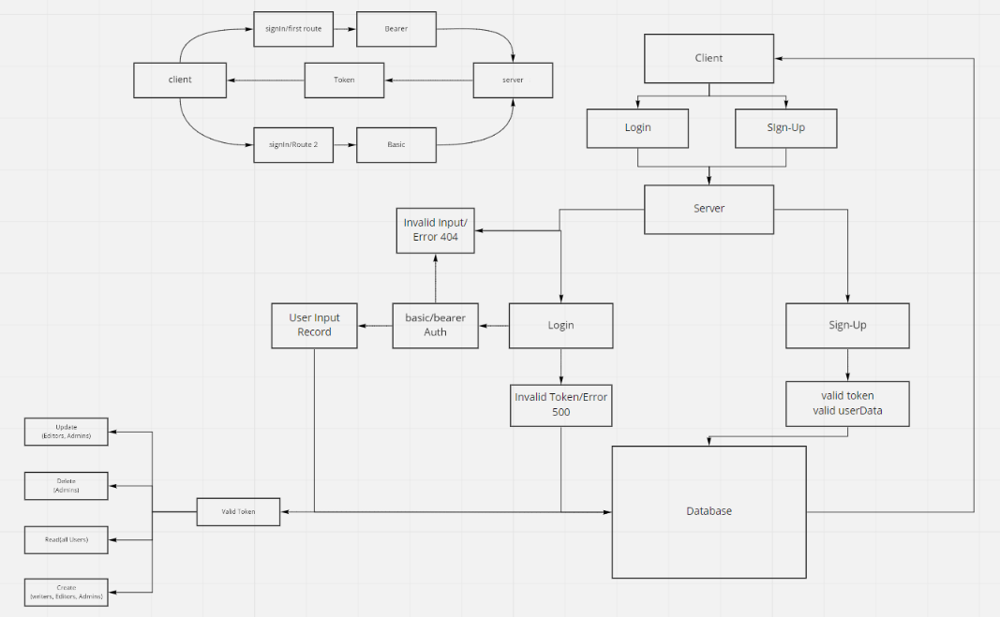

# auth-api
Created by Bryce Pfingston  

## Installation  
npm i { jest, express, dotenv, supertest, pg, sequelize, sqlite3, seqluelize-cli, bcrypt, base64, jsonwebtoken, cors, morgan, method-override }  
  
## Summary of Problem Domain  
integrating an api-server and an authorization server into one giant back end. 

## Links to application deployment  
 
Heroku: https://auth-api-bryce.herokuapp.com/
Githut: https://github.com/bpfingston/auth-api
  
## Include embedded UML

## Talk about your routes

routes:
    - SignIn:
        - validate user
        - HTTP POST
    - SignUp:
        - Create a new Username and Password
        - HTTP POST
    - Secret
        - Its a secret, can you keep it?
        - HTTP GET
    - Users
        - permissions for individual users.
        - HTTP GET